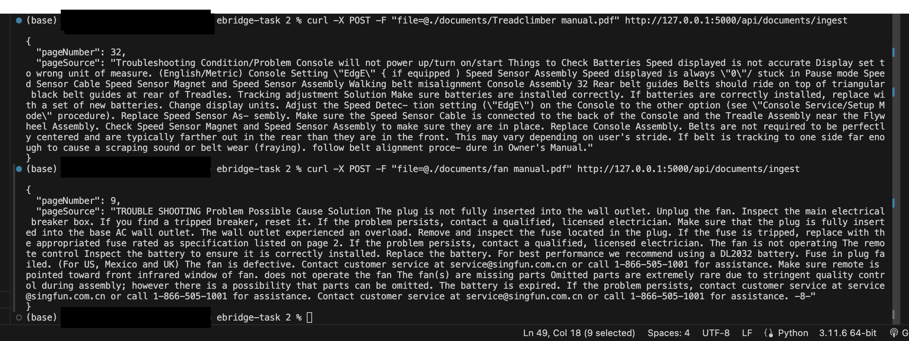
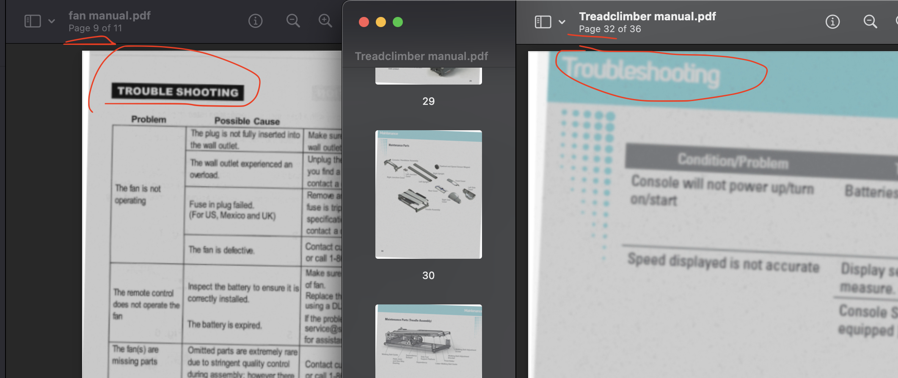

# Troubleshooting Section Finder using Azure AI Document Intelligence, Pinecone, GPT-4 with RAG.

This application is designed to automatically extract troubleshooting sections from uploaded PDF documents. It utilizes Azure AI, Pinecone database services, and OpenAI's GPT-4 Turbo model to identify and extract relevant sections efficiently.

## How It Works

1. **Text Extraction**: Azure AI Document Intelligence helps us scrape the text from the PDF files.
2. **Embedding Generation**: We use OpenAI's embedding model to convert the extracted text into meaningful vector representations.
3. **Storage**: These embeddings are stored in the Pinecone vector database.
4. **Retrieval**: Using Retrieval-Augmented Generation (RAG), we efficiently find and extract the troubleshooting sections from the PDF files.

By combining these advanced technologies, our application ensures accurate and efficient identification of troubleshooting information within documents.

## Getting Started

These instructions will get you a copy of the project up and running on your local machine for development and testing purposes.

### Prerequisites

What you need to install the software:

- Python 3.8 or higher (I used 3.11)
- Flask
- Azure AI Form Recognizer (Form Recognizer is now Azure AI Document Intelligence)
- Pinecone (In the code; I had to delete and create a new index for Pinecone because the free plan only allows one index per account, so we will need to re-upload the new PDF to the new index, FYI.)
- OpenAI GPT

### Installing

A step-by-step series of examples that tell you how to get a development environment running.

1. **Set up a virtual environment**

   ```bash
   python -m venv venv
   source venv/bin/activate  # On Windows use `venv\Scripts\activate`
   ```

2. **Install the required packages**

   ```bash
   pip install -r requirements.txt
   ```

3. **Set up configuration files**

   - **Azure Credentials**: Place your Azure AI credentials in the `azure.ini` file. (Azure Resource Group)
   - **Other Configuration**: Specify your OpenAI API key and other configurations in `config.py`. Replace the related places with your keys.


### Running the Application

To start the server, run:

```bash
python app.py
```

This will start the Flask application on `http://127.0.0.1:5000` by default.

### Example Usage

To test the application, you can use `curl` to send requests to the server using Terminal. 

```bash
curl -X POST -F "file=@./documents/fan manual.pdf" http://127.0.0.1:5000/api/documents/ingest
```

This sends a POST request to upload a file, and you should expect a JSON response that includes the page number and content of the identified troubleshooting section.


## Result




